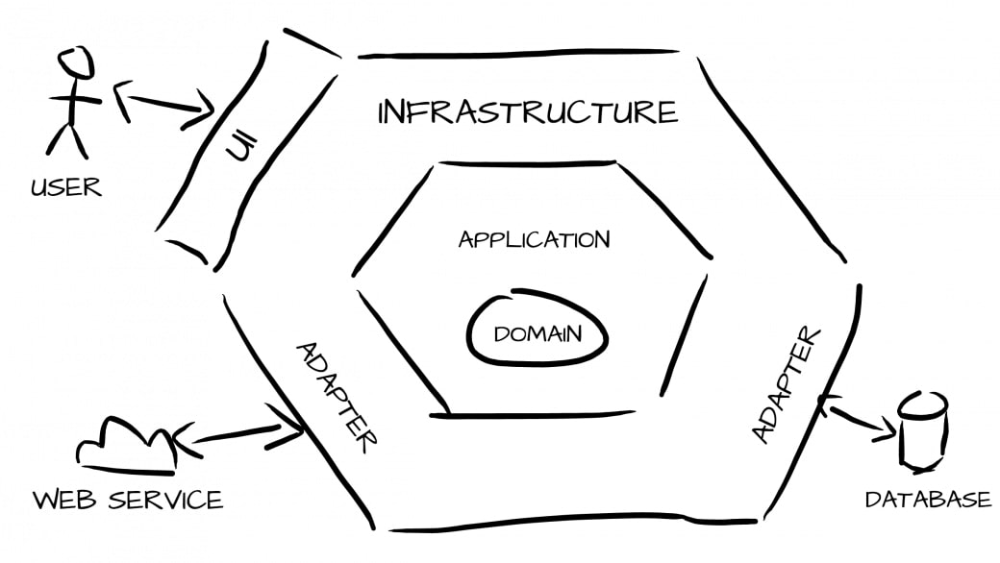

<!--suppress HtmlDeprecatedAttribute -->
<p align="center">
    
</p>

<h1 align="center">
  🐘🎯 Test technique: Architecture Hexagonale et Exemple de CQRS en Symfony
</h1>

<p align="center">
    <a href="#"></a>
</p>

<p align="center">
 Exemple d'architecture Hexa avec une implémentation de CQRS
   <br />
  <br />
Concept d'architecture hexagonale:
<h1 align="center">
  🐘🎯 Test technique: Architecture Hexagonale et Exemple de CQRS en Symfony
</h1>
</p>

## Préambule

Tout n'est pas implémenté, je me suis attaché à mettre en valeur les choix d'architecture, de leur implémentation et d'organisation du code

Uniquement le backend est développé et pour des facilités de test des commandes de console Symfony sont créées.
<p>
Il y a 3 facettes d'infrastructure:
Mock: mode boucho
DBAL: Abstraction de base de données : ici Doctrine sur une base PostgreSQL
Bus: Simulation d'un bus de Commandes et de Query
</p>
## 🚀 Installation

Le projet est écrit sur [Symfony][1] 6

### 🐳 Outils nécessaires

1. docker
2. docker-compose

### 🛠 Installation du projet

`make install`

Les crédentials de la base de données sont `project:secret`
### 🔥 Application execution

1. Install the backend dependencies: `composer install`.
3. Create database & tables with `php bin/console d:d:c` then `php bin/console make:migration`
   and `php bin/console migration:migrate` or force with `php bin/console d:s:u -f`

### ✅ Tester

1. Créer des produits: `docker-compose exec php ./bin/console app:dbal-create-product test test3 3.25 {"food":true,"to-take":false}`
2. lister les produits: `docker-compose exec php ./bin/console app:dbal-list-product`
### 🎯 Architecture Hexagonale

Ce référentiel suit le modèle d'architecture hexagonale. De plus, il est structuré à l'aide de "modules".
Avec cela, nous pouvons voir que la structure actuelle d'un contexte délimité est :

```scala
$ tree -L 5 src
    
src
├── Application
│   └── Product
│       ├── Create
│       │   ├── BusCreateProductCommand.php
│       │   ├── BusCreateProductCommandHandler.php
│       │   ├── DBALCreateProductCommand.php
│       │   └── MockCreateProductCommand.php
│       ├── List
│       │   ├── DBALListProductCommand.php
│       │   └── MockListProductCommand.php
│       └── Search
│           ├── BusSearchProduct.php
│           ├── BusSearchProductQuery.php
│           ├── BusSearchProductResponse.php
│           ├── DBALSearchProductCommand.php
│           └── MockSearchProductCommand.php
├── Domain
│   ├── Bus
│   │   ├── Command
│   │   │   ├── Command.php
│   │   │   ├── CommandBus.php
│   │   │   └── CommandHandler.php
│   │   └── Query
│   │       ├── Query.php
│   │       ├── QueryBus.php
│   │       ├── QueryHandler.php
│   │       └── Response.php
│   ├── Entity
│   │   ├── Product.php
│   │   └── Stock.php
│   ├── Persister
│   │   └── ProductInterface.php
│   └── Repository
│       └── ProductInterface.php
├── Infrastructure
│   ├── Adapter
│   │   ├── DBAL
│   │   │   ├── ProductPersister.php
│   │   │   └── ProductRepository.php
│   │   └── Mock
│   │       ├── ProductPersister.php
│   │       └── ProductRepository.php
│   ├── Bus
│   │   ├── Command
│   │   │   └── InMemoryCommandBus.php
│   │   ├── HandlerBuilder.php
│   │   └── Query
│   │       └── InMemoryQueryBus.php
│   ├── Http
│   │   ├── GetProductActionController.php
│   │   └── SearchProductResponder.php
│   └── Symfony
└── Kernel.php
```

La couche Application organise les Command et Query par des dossiers Objet/Action<br />
La couche Domain organise les éléments métier<br />
La couche Infrastructure organise les Adapters<br />

### 🎯 CQRS
Une implementation de type CQRS est mise en oeuvre de manière à séparer les écritures par des `Command` 
des opérations de lecture par des `Query`.

Ici je n'ai rien inventé de nouveau, une bonne explication de l'implémentation est visible en <a href='https://dev.to/adgaray/cqrs-with-symfony-messenger-2h3g'> CQRF with Symfony</p>